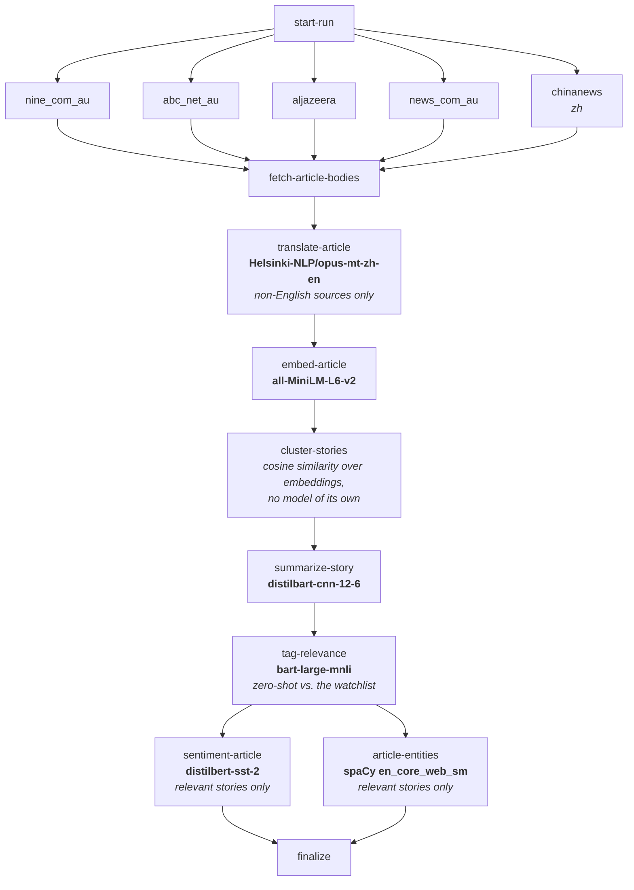
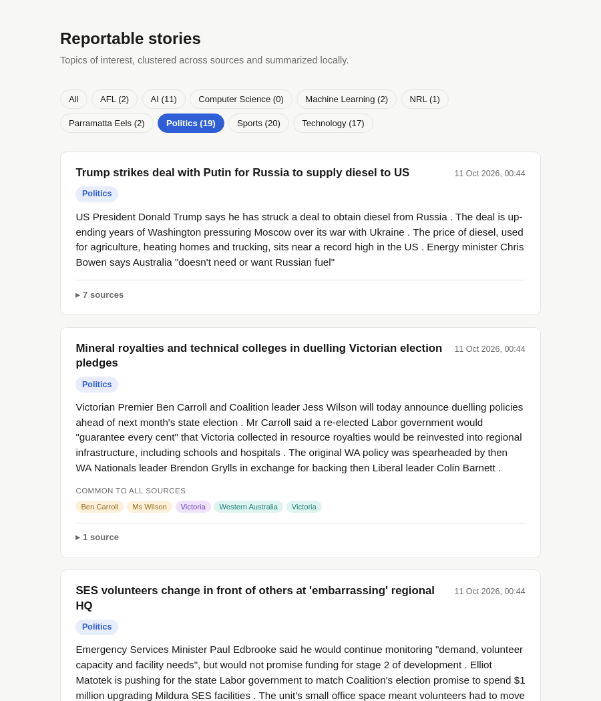

# myopic

**For the purposes of the application, see the `workflows/myopic_workflow.py` file**.

A home-lab news-intelligence pipeline. Every day it scrapes several news sources (nine.com.au,
ABC News, Al Jazeera, news.com.au, China News), clusters same-event coverage across sources into
stories, summarizes and sentiment-scores each one, and flags which stories match a user-managed
watchlist of topics and named entities - sports teams, politicians, companies, or broad subjects
like "AI" or "politics". China News is Chinese-language; its text is machine-translated to
English before anything else touches it, since every other model in the pipeline is English-only.
The watchlist itself is managed live through a small FastAPI CRUD service, with no redeploy
needed to add or remove what's being tracked.

Everything runs **locally** - spaCy for entity extraction, a zero-shot classifier for topic
tagging, distilled transformer models for summarization and sentiment, a small embedding model
for clustering. No external LLM APIs are called by default, though a local LLM path exists in
the codebase and can be swapped back in for the relevance-tagging step if needed.

## Architecture

The pipeline is coordinated by **Argo Workflows**, running as a daily CronWorkflow on a local
Kubernetes cluster (minikube). Each pipeline stage - discover, fetch, translate, embed, cluster,
summarize, tag for relevance, score sentiment, extract entities - runs as its own Argo task:
a pod that starts, loads whatever model it needs exactly once, loops over everything that stage
owns, writes its results to Postgres, and exits. There's no job queue, no message bus, and no
persistent model-serving process anywhere in the system - Argo's DAG scheduling and Postgres as
shared state are the only coordination mechanism required.

That design is deliberate, not incidental: this runs on a single minikube VM capped at 6GB of
RAM with no GPU, so the whole system is built to **scale to zero between runs**. Nothing stays
resident in memory once a run finishes - every model-loading pod is garbage-collected the moment
its work is done, so the idle cost of the whole pipeline is zero. Every model was chosen or
quantized specifically to fit this budget (a 4-bit GGUF build for the optional local LLM path,
distilled rather than full-size summarization/sentiment models, a small sentence-embedding
model, a compact spaCy pipeline for NER), and each stage's CPU/memory request is sized from
actual measurement against that 6GB ceiling, not guessed.

`discover` runs as one task per configured source, in parallel, each writing straight into the
shared `fetch-article-bodies` worklist. Every other labeled node names the actual model it loads;
`cluster-stories` has none of its own - it just does cosine-similarity matching over the vectors
`embed-article` already produced.

Relevance is decided **after** clustering and summarizing, not before: every fetched article
gets embedded and clustered regardless of watchlist relevance, and every story gets a summary.
Only then does `tag-relevance` check that short summary against the watchlist, and the two
downstream stages - sentiment and per-article entities - scope themselves back down to just the
stories that matched, since there's no reason to spend a CPU-bound model pass on a story nobody's
watching for. See [DEV.md](DEV.md) for the full rationale and how to run and deploy this
yourself.

## The story viewer

Each story shows a lead headline and date, the watchlist topics it matched, a locally-generated
summary, and then every source that covered it - with that source's own sentiment reading and
the people, organizations, and locations its own NER pass found. Stories can be filtered by
topic, with a live count of how many stories currently match each one.

## Documentation

See [DEV.md](DEV.md) for local development, Docker, Kubernetes deployment, and monitoring setup.
